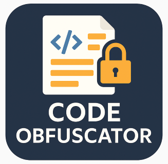

# Code Obfuscator for VS Code

A Visual Studio Code extension that helps developers obfuscate sensitive information in their code before sharing it with AI services like Claude or ChatGPT.

## Why This Extension?

When seeking help from AI coding assistants, you often need to share code snippets that might contain sensitive information such as:

- API keys and tokens
- Private URLs and endpoints
- Company-specific names and identifiers
- Database credentials
- Customer data

This extension allows you to easily replace sensitive information with generic placeholders while preserving the code structure, making it safe to share with AI services without exposing private data.

## Features

- **Select and Replace**: Highlight sensitive text and create obfuscation rules with a simple right-click
- **Consistent Replacements**: The same sensitive text is replaced with the same placeholder throughout your code
- **Rule Management**: View and manage all your obfuscation rules in a dedicated sidebar
- **Import/Export Rules**: Share rule sets with your team
- **One-Click Obfuscation**: Apply all rules with a single click

## Installation

1. Open VS Code
2. Go to Extensions (Ctrl+Shift+X)
3. Search for "Code Obfuscator"
4. Click Install

Or install from the [VS Code Marketplace](https://marketplace.visualstudio.com/items?itemName=yourpublisher.code-obfuscator).

## How to Use

### Creating a Rule

1. Select the sensitive text in your code
2. Right-click and select "Create Obfuscation Rule"
3. Enter a replacement value in the prompt
4. The selected text will be immediately replaced with your specified value

### Managing Rules

1. Click on the Code Obfuscator icon in the activity bar
2. View all your created rules in the sidebar
3. Click on a rule to toggle it on/off
4. Right-click on a rule to edit or delete it

### Applying Rules

- Rules are automatically applied when created
- To apply all rules to the current file, click the "Obfuscate" button in the status bar
- You can also right-click in the editor and select "Apply Obfuscation Rules"

### Exporting and Importing Rules

1. Open the command palette (Ctrl+Shift+P)
2. Type "Obfuscator: Export Rules" or "Obfuscator: Import Rules"
3. Follow the prompts to save or load your rule sets

## Configuration

This extension contributes the following settings:

- `codeObfuscator.enableAutoHighlight`: Enable/disable automatic highlighting of text matching obfuscation rules
- `codeObfuscator.defaultRuleScope`: Set the default scope for new rules (global, project, file)

## Tips for Effective Obfuscation

- Replace specific identifiers with generic ones (e.g., "AcmeCompany" → "COMPANY_NAME")
- Use consistent naming patterns for replacements (e.g., "API_KEY_1", "API_KEY_2")
- Create rules for common patterns in your codebase
- Export rule sets for different projects or contexts

## Troubleshooting

**Q: My rules are not being applied to all instances of the text.**  
A: Make sure the rule is enabled in the sidebar view. Check if you have "Case sensitive" enabled if your text has different capitalization.

**Q: The extension doesn't start properly.**  
A: Try reloading VS Code window (Ctrl+R) or reinstalling the extension.

## Contributing

Contributions are welcome! Please feel free to submit a Pull Request.

1. Fork the repository
2. Create your feature branch (`git checkout -b feature/amazing-feature`)
3. Commit your changes (`git commit -m 'Add some amazing feature'`)
4. Push to the branch (`git push origin feature/amazing-feature`)
5. Open a Pull Request

## License

This project is licensed under the MIT License - see the LICENSE file for details.

## Acknowledgements

- Icon made by [Author] from [Source]
- Thanks to all contributors who have helped shape this extension

---

**Made with ❤️ by [Nathan Clark](https://bsky.app/profile/dadfacts.bsky.social)**
